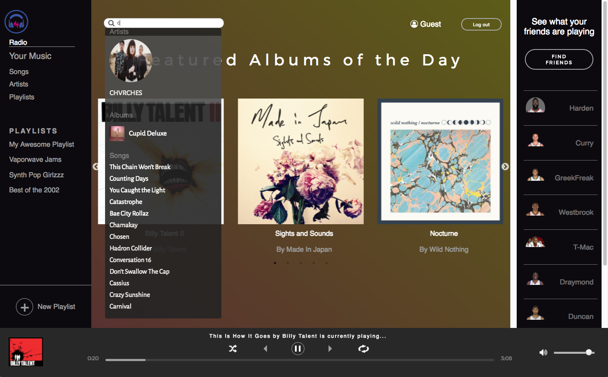

# Beathub

BeatHub is a music streaming application built with Ruby on Rails and React/Redux.
For Android & IOS please check out [this React Native version](https://github.com/jestir1234/BeatHub-Mobile).

:notes:  [BeatHub][heroku]  :notes:

[heroku]: http://www.beathub.us/#/


By Matthew Nguyen

Contact: <matt.duy.nguyen@gmail.com>



## Features and Implementation

### Design Intentions
Inspired by the downloadable Spotify app (as opposed to the web version), I designed the app with the intention of replicating a pure single-page experience. With the exception of the login and signup routes, there is only one route.

```
const Root = ({ store }) => (
  <Provider store={ store }>
    <Router history={ hashHistory }>
      <Route path='/' component={ App } >
        <Route path='signup' component={ SignUpContainer } onEnter={_redirectIfLoggedIn}/>
        <Route path='login' component={ LoginContainer } onEnter={_redirectIfLoggedIn}/>
        <IndexRoute component={ HomeContainer } onEnter={_ensureLoggedIn}/>
      </Route>
    </Router>
  </Provider>
);
```

The central component, which displays the pages of interest, is a single component that re-renders entirely with different DOM Elements depending on the type of presentation Item prop it receives (i.e. Artists, Albums, Playlists, User Profiles, etc).

```
export const receivePresentationItem = (presentationItem, presentationType) => {
  return {
    type: RECEIVE_PRESENTATION_ITEM,
    presentationItem: presentationItem,
    presentationType: presentationType
  };
};

export const removePresentationItem = (presentationItem) => {
  return {
    type: REMOVE_PRESENTATION_ITEM,
    presentationItem
  };
};
```

Similar to the Spotify downloadable app, as Users navigate to different points of interest, the central component will change while the Audio Player, User Menu, Friends List, and Search Bar, all of which are separate components will remain unchanged unless a change is warranted. For example, when User A unfollows another User B while visiting User B's profile page, User B will immediately disappear from User A's friend list on the right side. Likewise, play buttons will sync between the central component and the Audio Player.


### :guitar: My Music: Playlist and Playlist Song CRUD
`User`s create `Playlist`s and can search and save `Song`s they discover throughout the application. Individual Songs can be played by clicking the Play button next to the track or the Play button beneath the Album/Playlist artwork to hear the playlist or album in its entirety by queuing all of their songs. Right clicking any song will bring up a context menu to either add the song to the queu, add the song to a Playlist, or remove the song if the User is currently on the playlist's page. Users can view their collection of personal playlists in their profile page, available at the top right.

### :thumbsup: Following and Unfollowing Users
Users can follow and unfollow other users. A list of followed users exists on the right side-bar. Clicking an the follower's name will navigate the User to the follower's profile page, which shows their followed artists and personal playlists. Clicking 'Find Friends' will bring up a modal of all Users with a follow option next to each User's name.

### :headphones: Continuous Music Playback While Navigating the Site
The application contains a `CurrentSong` slice of state which initializes as empty. Whenever a song is played, CurrentSong receives a song object which gets passed into the 'AudioPlayer' component which renders the SoundComponent, a react library that makes it easier to configure the song's properties (position, volume, duration). There is also a Queu slice of state that holds any other songs that have been added to the Queu. When the CurrentSong ends, the AudioPlayer will remove the first song from the Queu (if one exists) and send it to the CurrentSong component to be played. User can interact with song through AudioPlayer interface buttons (skipping to the next song, pausing the current song, repeating the current song, or shuffling the current queu of songs).

### :minidisc: Browse: BeatHub Music Library
User's can search for music at all times through the search bar. Each triggered input will send an ajax request to the server which will find any matches for Artists, Albums, and Songs. A dropdown will appear below the search bar, populated with the results which the User can click on to navigate to.

### :radio: Radio
User's can click the radio link at the top left of the app to generate a random queu of songs. While the play button on every Artist's page will play a random song by the Artist.

## Future Directions for the Project

### Listening Parties:
Users can create a chatroom as the 'Host' and be the DJ, servicing the songs. Other users can join the 'Party' to listen to the live stream as well as communicate in the chatroom.

-- -- --

The BeatHub music library is populated by talented artists and has no rights to the music. This project is merely for academic purposes and is and never will be in production for the purpose of generating a profit. All rights belong to the credited artists -- please support these artists by buying their music.

[git]: https://github.com/jestir1234/
